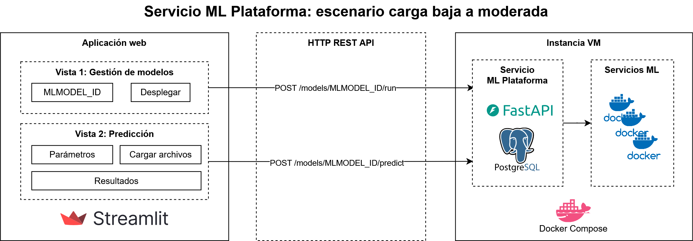

# Icesi ML Plataforma

Plataforma prototipo para despliegue y consumo de servicios ML.

# Diseño

## Escenario demanda baja a moderada: Docker



# Servicios ML

En [services/ml-platform/README.md](./services/ml-platform/README.md) se presentan algunas consideraciones de configuración de servicios ML.

Ejemplos de desarrollo de servicios ML:
- [services-ml/ejemplo-enfermedad]: ejemplo con los mínimos requerimientos funcionales de un servicio ML
- [services-ml/ejemplo-iris]: ejemplo de servicio cargando modelo ONNX desde directorio compartido de modelos

# Despliegue

**Despliegue local con Docker Compose:**

Construir y ejecutar contenedores:
```sh
docker compose build
docker compose up
```

_Nota: los anteriores comandos han sido ejecutados correctamente desde WSL2 con Ubuntu. Se tuvieron dificultades con la ejecución directamente desde Windows mapeando el demonio de Docker. Se presume correcta ejecución en cualquier plataforma Unix (Linux y macOS)._
